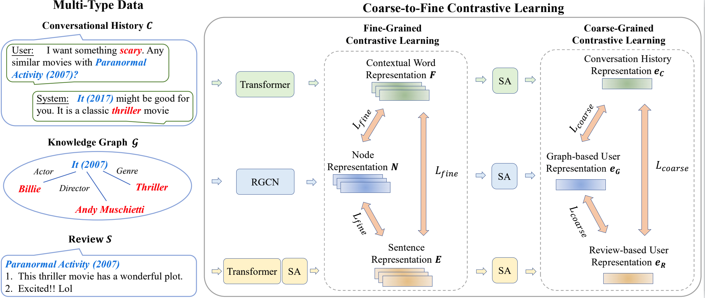

# C2-CRS: Coarse-to-Fine Contrastive Learning for CRS
The source code for our WSDM 2022 Paper [**"C2-CRS: Coarse-to-Fine Contrastive Learning for Conversational Recommender System"**](https://arxiv.org/abs/2201.02732)


## Requirements
* Python == 3.8
* Pytorch == 1.8.1
* CRSLab == 0.1.2

## Overview
We proposed a novel contrastive learning based coarse-to-fine pre-training approach for conversational recommender system.  By utilizing the coarse-to-fine pre-training strategy, multi-type data representations can be effectively fused, such that the representations for limited conversation context are further enhanced, which finally improve the performance of CRS.



## Datasets and Other Resource
### Datasets
We use two datasets in our paper, all of which have been uploaded to [Google Drive](https://drive.google.com/file/d/1tVZ4d_MED0WkbXT65M93aedXyFSMi3eD/view?usp=sharing) and [Baidu Netdisk](https://pan.baidu.com/s/1uDY7gmiQLZjtPOPtbG_5hg) (password: 2ho6).

The downloaded `dataset` folder should be placed in the `data` folder.

### Saved Models
We have trained our model on two datasets and saved the parameters, all of which have been uploaded to [Google Drive](https://drive.google.com/file/d/10AuaBsoEoGsn2usrsvMXhS-fqGfmIWdA/view?usp=sharing) and [Baidu Netdisk](https://pan.baidu.com/s/1otJotSaDpNoL7FYRg1tSfQ) (password: 44kr).

The downloaded `save` folder should be placed in the root folder of this project.

## Quick-Start
You can train the model.
```
sh script/redial/train/redial_rec_train.sh
sh script/redial/train/redial_conv_train.sh # remember to change --restore_path

sh script/tgredial/train/tgredial_rec_train.sh
sh script/tgredial/train/tgredial_conv_train.sh # remember to change --restore_path
```

You can also test the model has been saved by us.
```
sh script/redial/eval/redial_rec_eval.sh
sh script/redial/eval/redial_conv_eval.sh

sh script/tgredial/eval/tgredial_rec_eval.sh
sh script/tgredial/eval/tgredial_conv_eval.sh
```

## Contact
If you have any questions for our paper or codes, please send an email to sdzyh002@gmail.com.

## Acknowledgement 
Our code is developed based on [CRSLab](https://github.com/RUCAIBox/CRSLab)

And thanks the code from [SimCLR](https://github.com/sthalles/SimCLR.git)

Any scientific publications that use our codes and datasets should cite the following paper as the reference:
```
@inproceedings{10.1145/3488560.3498514,
title = {C²-CRS: Coarse-to-Fine Contrastive Learning for Conversational Recommender System},
author = {Zhou, Yuanhang and Zhou, Kun and Zhao, Wayne Xin and Wang, Cheng and Jiang, Peng and Hu, He},
booktitle = {WSDM},
year = {2022},
}
```